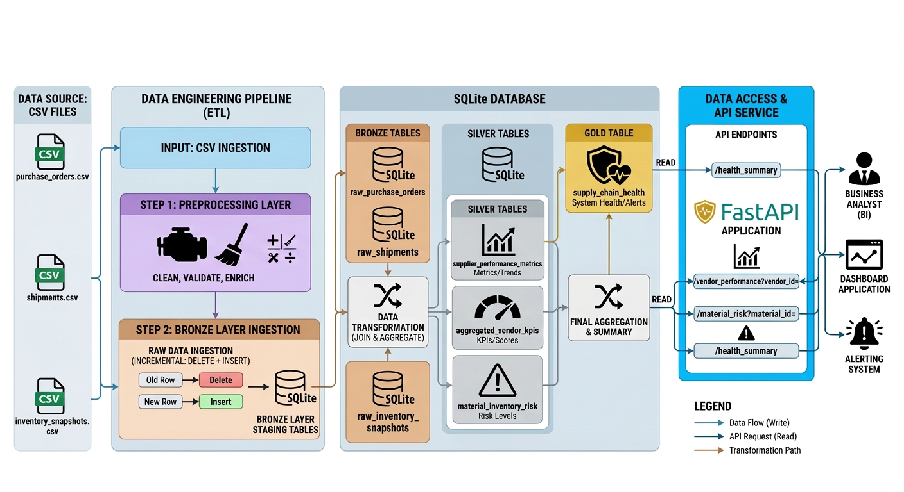

# Supply Chain Health

This project consists of preprocessing, transforming,
and applying analytics on supply chain data to obtain
insights and analytics ready, aggregated data for visualization.

### Some of the best practices used in the project:

1. Preprocessing & cleaning of the raw data
2. Medallion Data Architecture 
3. Incremental updates to bronze layer (delete+insert strategy)
4. Aggregation & Business KPI in silver and gold layer tables
5. Snapshotting of the analytics ready data for future usage
6. Modularized code with sufficient documentation
7. API endpoints to access the aggregated data & cleaned raw data
8. Visualization of supply chain health metrics

### Here is the architecture diagram of the project:

## Instructions to run:

